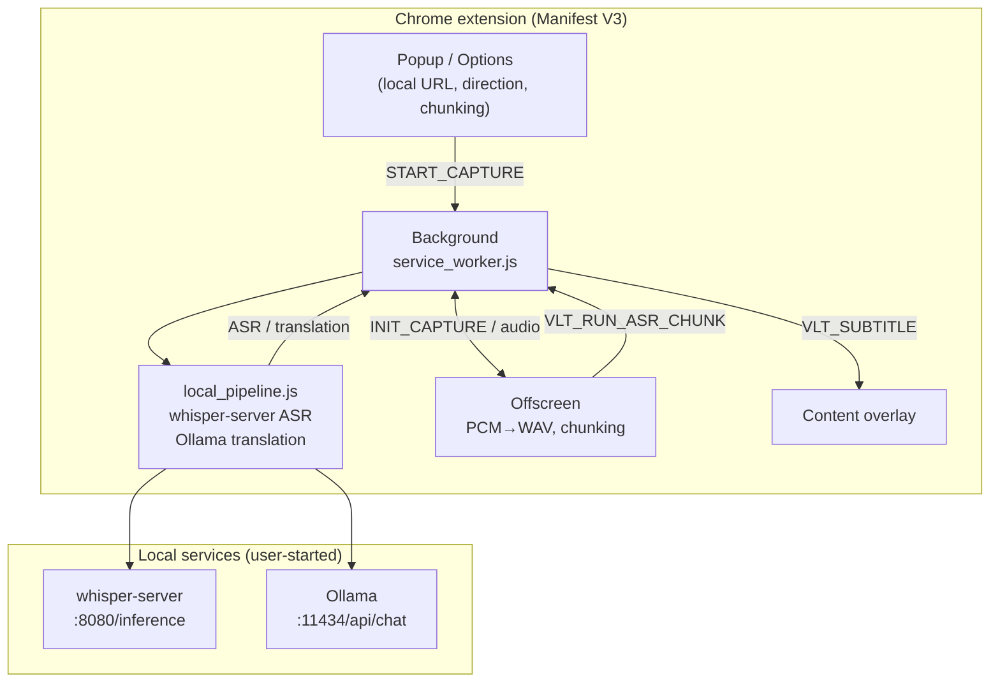

# Video Live Translate (Chrome Extension)

**Extension version:** **0.7.3** (matches **`version`** in root `manifest.json`). **Doc sync index:** [`docs/DOC_SYNC.md`](docs/DOC_SYNC.md).

Manifest V3: **capture the active tab’s audio** and run a **fully local** pipeline: **ASR (Whisper) → (optional) Ollama translation → overlay subtitles**.

- **ASR:** local [whisper.cpp](https://github.com/ggml-org/whisper.cpp) **`whisper-server`** (`POST …/inference`, multipart `file`); audio is sent only to the base URL you set in options. Recognition language can be **auto-detected** or **manual** (in sync with Popup / Options “speech translation direction”).
- **Translation:** local **Ollama** (`/api/chat`, `think=false`); **source and target** can be set in Popup or Options (**many common languages**; typical pairs include EN/JA → Traditional Chinese). Translation can be turned off to show recognition text only.
- **Cost:** the extension and this pipeline use **no per-call third-party inference APIs**; cost is **your own hardware / power** and maintaining local services.

**Sections (top to bottom):** overview → architecture → quick start → debugging → repo layout → related projects → troubleshooting → privacy & limits → distribution & contributing → license → languages

**Development status:** [`docs/DEVELOPMENT_PROGRESS.md`](docs/DEVELOPMENT_PROGRESS.md) (aligned with `manifest.json`); task checklist [`tasks/todo.md`](tasks/todo.md). **Performance / pipeline ideas:** [`docs/OPTIMIZATION_NOTES.md`](docs/OPTIMIZATION_NOTES.md). **How versions map across docs:** [`docs/DOC_SYNC.md`](docs/DOC_SYNC.md).

---

## Overview

### What it does

- **Speech recognition:** only via the **whisper-server base URL** in options (default `http://127.0.0.1:8080`). Run `scripts/start_whisper_server_example.bat` first (edit paths).
- **Translation:** **Ollama** (default `http://127.0.0.1:11434`) or **no translation** (subtitles show ASR text only).
- **Language direction:** **Popup** and **Options** keep “speech translation direction” in sync (including **⇄ swap** source/target; swap is disabled when source is “auto-detect”). Advanced: separate “translation prompt source” if configured.
- **Chunking:** audio is processed in **2–12 s** chunks (default 4 s); subtitles update per chunk. **Popup “pipeline summary”** includes a slider for chunk length (synced with Options).

### Terms

- **ASR:** automatic speech recognition (speech → text). **whisper-server** outputs **recognition text** (language from settings or auto-detect).
- **Translation:** after ASR, **Ollama** turns that text into the **selected target language** (optional).

### Limits

Many **DRM-protected** sites cannot expose tab audio to capture. **Full-session SRT export** is not built in yet.

---

## Architecture

**Flow:** Popup / Options → **Service Worker** → **Offscreen** (`tabCapture`, PCM→WAV) → `VLT_RUN_ASR_CHUNK` → **`local_pipeline.js`** (whisper-server + Ollama) → **Content** overlay.



Use `<br/>` for line breaks in nodes. Preview with a Mermaid-capable viewer if needed.

### Can the extension auto-start local services?

**No.** The extension cannot run `.exe` files for you. Start **whisper-server** and **Ollama** manually or via OS scheduling; advanced: [Native messaging](https://developer.chrome.com/docs/extensions/develop/concepts/native-messaging).

---

## Quick start

### 1. Load the extension

`chrome://extensions` → Developer mode → **Load unpacked** → select this folder.

### 2. Local services

**First-time setup?** See **[`docs/LOCAL_SETUP.md`](docs/LOCAL_SETUP.md)** (whisper-server, Ollama, startup commands, 403 notes). The **Options** page has a “first run” section with copy-paste terminal commands.

1. Start **whisper-server** (`scripts/start_whisper_server_example.bat` or LOCAL_SETUP).
2. Start **Ollama** (`ollama serve`); pull a model (default suggestion: [TranslateGemma](https://ollama.com/library/translategemma) `ollama pull translategemma:4b`, ~3.3GB; `translategemma:12b` etc. also work). If the extension gets **403** from Ollama, set **`OLLAMA_ORIGINS=chrome-extension://*`** and restart Ollama, or use `scripts/start_ollama_allow_extensions.bat`.

### 3. Options

**Extension options** → set **local whisper-server base URL** (required) → **speech translation direction** (synced with Popup) → **Ollama translation** or **no translation** → confirm Ollama URL / model (default **`translategemma:4b`**, same as smoke test scripts) → **Save**. TranslateGemma **user prompt** shape follows [TranslateGemma docs](https://ollama.com/library/translategemma) (actual pair comes from settings and `vlt_llm_config`).

### 4. Use

Open a page with audio → toolbar → in Popup confirm **source / target** and chunk length if needed → **Start capture**. After changing Whisper / Ollama URLs or engine, **stop and start** again; for **direction or chunk size only**, follow on-screen hints. After **manifest** changes, **reload the extension**.

---

## Debugging: confirm audio

Enable **debug overlay** in Popup → reload the video tab → capture again; **raw RMS** should move. Advanced: Service worker / offscreen console.

---

## Repository layout

```
chrome_video_live_translate/
  LICENSE
  manifest.json
  README.md
  README.zh-TW.md
  icons/
  docs/
    DOC_SYNC.md
    DOC_SYNC.zh-TW.md
    LOCAL_SETUP.md
    LOCAL_SETUP.zh-TW.md
    ONBOARDING.md
    ONBOARDING.zh-TW.md
    DEVELOPMENT_PROGRESS.md
    DEVELOPMENT_PROGRESS.zh-TW.md
    PRODUCT_DESIGN_FRAMEWORK.md
    PRODUCT_DESIGN_FRAMEWORK.zh-TW.md
    OPTIMIZATION_NOTES.md
    OPTIMIZATION_NOTES.zh-TW.md
    PHASE_REPORT_TRANSLATION_PIPELINE.md
    PHASE_REPORT_TRANSLATION_PIPELINE.zh-TW.md
  tasks/
    todo.md
  scripts/
  src/
    shared/
    background/
    content/
    options/
    popup/
    offscreen/
```

See **`docs/ONBOARDING.md`** (if anything conflicts with `manifest.json`, prefer this README and source).

---

## Related project: `whisper_transcribe_test_repo`

A separate repo can use **whisper-cli** for **whole-file** `.txt` / `.srt`; this extension uses **whisper-server** streaming chunks—no need to merge codebases.

---

## Troubleshooting

### Popup: `reading 'local'`

**v0.2.1+** Popup reads storage for offscreen; **reload the extension**.

### Ollama **403**, subtitles show only bracketed English (translation not applied)

See **OLLAMA_ORIGINS** above and `scripts/start_ollama_allow_extensions.bat`.

### Whisper connection failed

Confirm **whisper-server** is listening, Options URL/port are correct, and firewall allows **localhost**.

---

## Privacy & limits

- **Audio and recognition text** go only to your configured **local whisper-server**; **translation** runs on **local Ollama** (no Ollama calls if “no translation”).

---

## Distribution & contributing

| Channel | Role |
|--------|------|
| **GitHub (primary)** | Source and issues; **Load unpacked**. |
| **Chrome Web Store (optional)** | Another install path; details still on GitHub. |

Issues and PRs welcome. Store listing needs its own privacy / permission narrative (this build has **no** remote inference host permission beyond `<all_urls>` for the content-script overlay and localhost).

---

## License

[**Apache License 2.0**](https://www.apache.org/licenses/LICENSE-2.0) — see [`LICENSE`](LICENSE).

- **SPDX:** `Apache-2.0`
- **Copyright:** Copyright 2026 Brian Chang

---

## Languages

- [English](README.md)
- [繁體中文](README.zh-TW.md)
