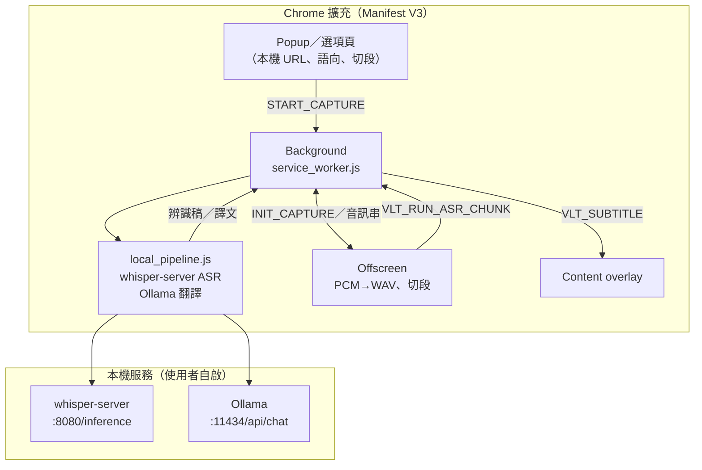

# Video Live Translate（Chrome 擴充功能）

**擴充版本**：**0.7.3**（與根目錄 `manifest.json` 的 **`version`** 一致）。**文件同步清單（英文主文件）**見 [`docs/DOC_SYNC.md`](docs/DOC_SYNC.md)；**繁體中文版**見 [`docs/DOC_SYNC.zh-TW.md`](docs/DOC_SYNC.zh-TW.md)。

Manifest V3：**擷取目前分頁音訊**，以**完全本機**管線做 **ASR（Whisper）→（可選）Ollama 翻譯 → 浮層字幕**：

- **ASR**：本機 [whisper.cpp](https://github.com/ggml-org/whisper.cpp) **`whisper-server`**（`POST …/inference`，multipart `file`）；音訊僅送至選項內填寫的本機網址。辨識語言可 **自動偵測**或**手選**（與 Popup／選項「語音翻譯語向」同步）。
- **翻譯**：本機 **Ollama**（`/api/chat`，`think=false`）；**來源語與目標語**可於 Popup 或選項頁設定（**多種常用語言**互譯，預設情境仍常見如英／日 → 繁中）；可關閉翻譯僅顯示辨識稿。
- **費用**：擴充本身與上述管線**無按次計費 API**；成本為**自有硬體／電力**與本機服務維護。

**章節導覽（由上而下）：** 專案概要 → 功能與系統架構圖 → 快速開始 → 除錯 → 專案結構與原始碼 → 相關專案 → 疑難排解 → 隱私與限制 → 分發與貢獻 → 授權 → 語言／Languages

**開發進度（英文主文件）：** [`docs/DEVELOPMENT_PROGRESS.md`](docs/DEVELOPMENT_PROGRESS.md)；**繁體中文版** [`docs/DEVELOPMENT_PROGRESS.zh-TW.md`](docs/DEVELOPMENT_PROGRESS.zh-TW.md)。任務勾選見 [`tasks/todo.md`](tasks/todo.md)。**效能／管線優化構想** 英文 [`docs/OPTIMIZATION_NOTES.md`](docs/OPTIMIZATION_NOTES.md)／繁中 [`docs/OPTIMIZATION_NOTES.zh-TW.md`](docs/OPTIMIZATION_NOTES.zh-TW.md)。

---

## 專案概要

### 能做什麼

- **語音辨識**：僅透過你填在選項裡的 **whisper-server 根網址**（預設 `http://127.0.0.1:8080`）。請先執行 `scripts/start_whisper_server_example.bat`（路徑請自改）。
- **翻譯**：**Ollama**（預設 `http://127.0.0.1:11434`）或選 **不翻譯**（字幕僅辨識稿）。
- **語向**：**Popup** 與 **選項頁**頂部「語音翻譯語向」即時同步（含 **⇄ 一鍵交換**來源／譯為；來源為「自動偵測」時無法交換）；進階可另設「翻譯提示詞來源」。
- **切段**：音訊 **2–12 秒** 一段（預設 4 秒），字幕**分段更新**；**Popup「系統管線摘要」內可拖曳滑桿**快速調整切段秒數（與選項頁同步）。

### 術語與縮寫

- **ASR**：自動語音辨識（語音→文字），由 **whisper-server** 依設定語言產出**辨識稿**（可自動偵測語言）。
- **翻譯**：ASR 之後由 **Ollama** 將辨識稿轉成**所選目標語**（可關閉）。

### 切段與限制

部分 **DRM** 網站無法擷取分頁音訊。**整段匯出 SRT** 尚未內建。

---

## 功能與系統架構圖

**流程摘要：** Popup／選項 → **Service Worker** → **Offscreen**（`tabCapture`、PCM→WAV）→ `VLT_RUN_ASR_CHUNK` → **`local_pipeline.js`**（whisper-server + Ollama）→ **Content** 浮層。



節點換行使用 `<br/>`。若 Mermaid 無法預覽，請用支援 Mermaid 的編輯器。

### 本機服務能否由擴充自動啟動？

**不能。** 擴充無法代為執行 `.exe`。請手動或工作排程啟動 **whisper-server**、**Ollama**；進階可考慮 [Native messaging](https://developer.chrome.com/docs/extensions/develop/concepts/native-messaging)。

---

## 快速開始

### 1. 載入擴充

`chrome://extensions` → 開發人員模式 → **載入未封裝項目** → 選本資料夾。

### 2. 本機環境

**尚未安裝？** 英文主文件 **[`docs/LOCAL_SETUP.md`](docs/LOCAL_SETUP.md)**；繁體 **[`docs/LOCAL_SETUP.zh-TW.md`](docs/LOCAL_SETUP.zh-TW.md)**。擴充**選項頁**頂部亦有「首次使用」摺疊區，可**複製**常用終端機指令。

1. 啟動 **whisper-server**（見 `scripts/start_whisper_server_example.bat` 或 LOCAL_SETUP）。
2. 啟動 **Ollama**（`ollama serve`）；模型需先 `ollama pull`（預設建議：[TranslateGemma](https://ollama.com/library/translategemma) `ollama pull translategemma:4b`，約 3.3GB；可改用 `translategemma:12b` 等）。若擴充對 Ollama **403**，請設 **`OLLAMA_ORIGINS=chrome-extension://*`** 後重啟 Ollama，或使用 `scripts/start_ollama_allow_extensions.bat`。

### 3. 選項

**擴充選項** → 填 **本機 whisper-server 網址**（必填）→ 設定 **語音翻譯語向**（與 Popup 同步）→ 選 **Ollama 翻譯** 或 **不翻譯** → 確認 Ollama URL／模型（**預設模型名**與煙測腳本一致為 **`translategemma:4b`**，可自改）→ **儲存**。TranslateGemma 路線的 **user 提示詞**結構對齊 [TranslateGemma 文件](https://ollama.com/library/translategemma)（實際語向由設定與 `vlt_llm_config` 決定）。

### 4. 使用

一般網頁播放有聲音的內容 → 工具列 → 在 Popup 確認 **聽譯來源／譯為** 與（必要時）**切段秒數** → **開始擷取音訊**。變更 Whisper／Ollama URL 或翻譯引擎等選項後請 **停止再開始**；**僅調語向或切段秒數**可依介面提示決定是否重開擷取。改 manifest 後 **重新載入擴充**。

---

## 除錯：如何確認有音訊資料

Popup 勾選 **除錯浮層** → 重新整理影片分頁 → 再擷取；應見 **raw RMS** 變動。進階：Service worker / offscreen Console。

---

## 專案結構與原始碼

```
chrome_video_live_translate/
  LICENSE
  manifest.json
  package.json
  README.md
  README.zh-TW.md
  tests/
    architecture/
    integration/
    helpers/
  icons/
  docs/
    DOC_SYNC.md / .zh-TW.md
    LOCAL_SETUP.md / .zh-TW.md
    ONBOARDING.md / .zh-TW.md
    DEVELOPMENT_PROGRESS.md / .zh-TW.md
    PRODUCT_DESIGN_FRAMEWORK.md / .zh-TW.md
    OPTIMIZATION_NOTES.md / .zh-TW.md
    PHASE_REPORT_TRANSLATION_PIPELINE.md / .zh-TW.md
  tasks/
    todo.md
  scripts/
  src/
    shared/
    background/
    content/
    options/
    popup/
    offscreen/
```

### 自動化測試（Node 18+）

- **`npm test`**：架構／契約測試，`fetch` 為 **mock**，**不需**本機 whisper／Ollama（`tests/architecture/`）。
- **`npm run test:integration`**：**可選**連線本機 **whisper-server** 與 **Ollama**（若未設定則由腳本啟用 `VLT_INTEGRATION`）。服務未起來時各測項會 **skip**，整體仍 **exit 0**。可設 `VLT_WHISPER_URL`、`VLT_OLLAMA_URL`、`VLT_OLLAMA_MODEL`；若要強化 ASR 可設 `VLT_INTEGRATION_WAV_BASE64`。Windows 可執行 `scripts\run_integration_tests.bat`。

詳見 **`docs/ONBOARDING.md`**（英文）或 **`docs/ONBOARDING.zh-TW.md`**（繁體）；若內文與 `manifest.json` 當前版本衝突，以 **英文 README** 與原始碼為準。

---

## 相關專案：`whisper_transcribe_test_repo`

可另備 repo 用 **whisper-cli** 做**整檔**轉 `.txt`／`.srt`；與本擴充 **whisper-server** 路徑不同，無需合併。

---

## 疑難排解

### Popup：`reading 'local'`

**v0.2.1+** 由 popup 讀 storage 傳 offscreen；請重新載入擴充。

### Ollama **403**、字幕僅見方括號內之辨識稿（翻譯未生效）

見上文 **OLLAMA_ORIGINS** 與 `scripts/start_ollama_allow_extensions.bat`。

### 本機 Whisper 連線失敗

確認 **whisper-server** 已 listen、選項網址與埠正確、防火牆未擋 **localhost**。

---

## 隱私與限制

- **音訊與辨識稿**僅送向你設定的 **本機 whisper-server**；**譯文推論**在 **本機 Ollama**（選「不翻譯」則無 Ollama 請求）。

---

## 分發與貢獻

| 管道 | 定位 |
|------|------|
| **GitHub（主要）** | 原始碼與議題；**載入未封裝項目**。 |
| **Chrome 商店（補充）** | 可選安裝入口；細節以 GitHub 為主。 |

歡迎 **Issue／PR**。上架商店請另備隱私與權限說明（本版**無**對外推論 API 主機權限，僅 `<all_urls>` 供內容腳本字幕浮層與本機 localhost）。

---

## 授權

[**Apache License 2.0**](https://www.apache.org/licenses/LICENSE-2.0) — 全文見 [`LICENSE`](LICENSE)。

- **SPDX**：`Apache-2.0`
- **著作權**：Copyright 2026 Brian Chang

---

## Languages

- [English](README.md)
- [繁體中文](README.zh-TW.md)
